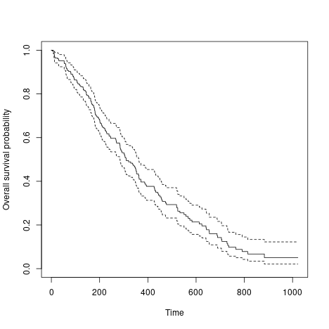
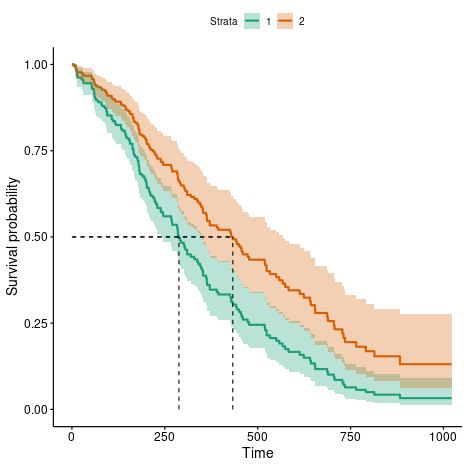

This is a very early attempt to seed Shiny projects via the familiar survival analysis whose source code is available from

[https://github.com/jinghuazhao/ShinyApps/](https://github.com/jinghuazhao/ShinyApps/)

An end-user can upload his/her own data for analysis and download the analysis report. The following aspects are experimented with data from 
R/survival package as follows:

```r
library(survival)
write.csv(survival::lung,file="lung.csv",quote=FALSE,row.names=FALSE)
```

# Data

This takes a local file in .csv or .tsv format, such as `lung.tsv` from above.

# Download

The input data can be saved in a variety of format -- is is actaully a template for downloading results.

# Model

Once the data is uploaded, this defines the model as in the example.

# Report

This is a file containing the commands and plots. For the current example, we have

## Kaplan-Meier curve



## Cox survival curve



