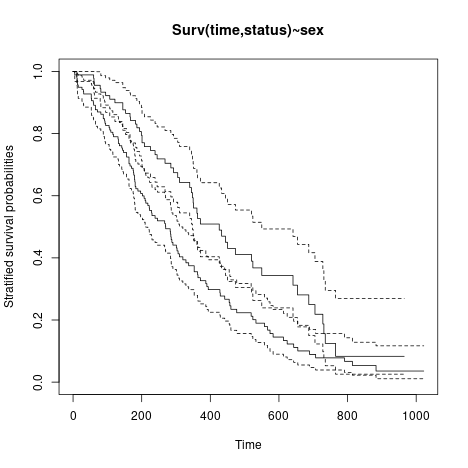
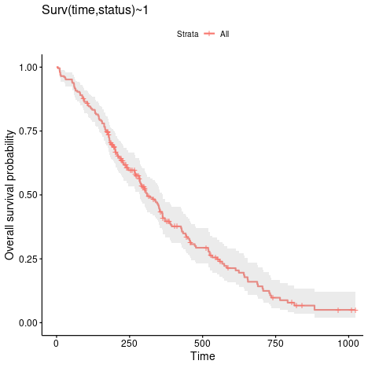
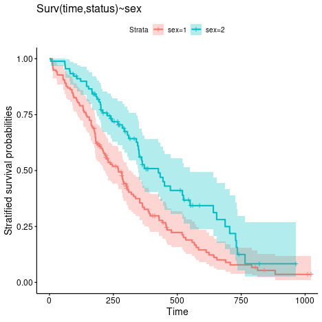
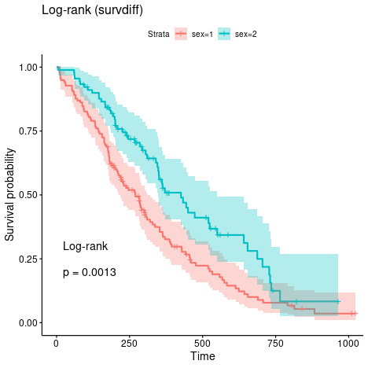
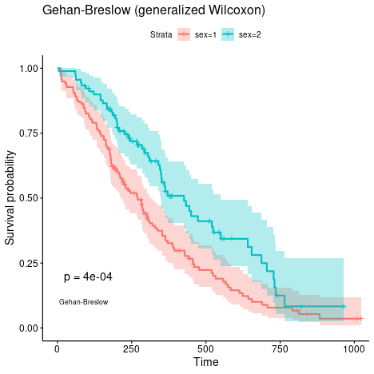
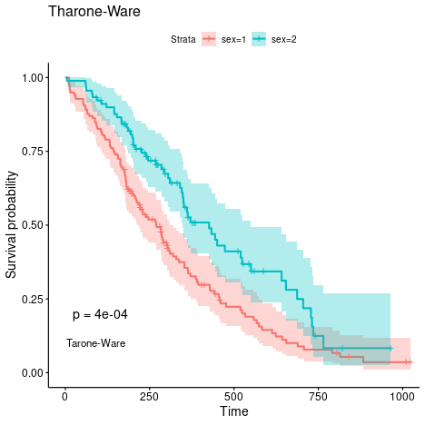
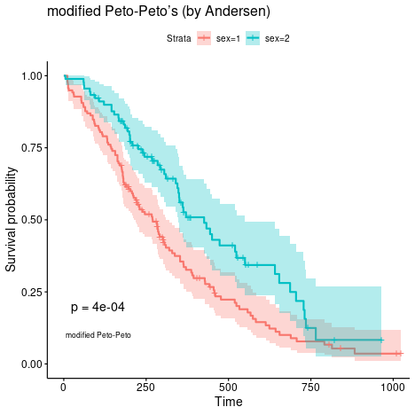
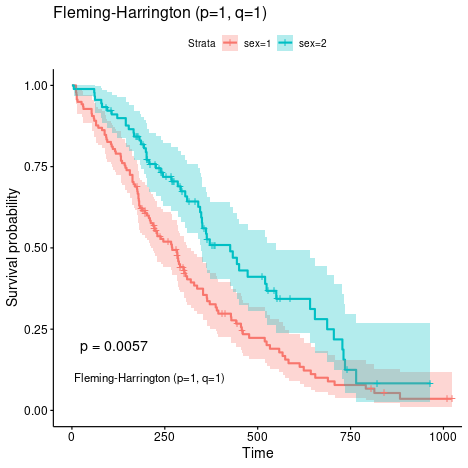

This is a very early attempt to seed Shiny projects whose source code is available from

[https://github.com/jinghuazhao/ShinyApps/](https://github.com/jinghuazhao/ShinyApps/)

It would however be appropriate for clinicians who know the concepts of survival analysis in clinical trials but nevertheless find difficulties with 
use of statistical packages such as SAS, Stata or R.

An end-user can upload his/her own data for analysis and download the analysis report. The following aspects are experimented with data from 
R/survival package as follows:


```r
library(survival)
write.csv(survival::lung,file="lung.csv",quote=FALSE,row.names=FALSE)
```

# Data

This takes a local file in .csv or .tsv format, such as `lung.tsv` from above.

# Download

The input data can be saved in a variety of format -- is is actaully a template for downloading results.

# Model

Once the data is uploaded, this defines the model as in the example.

# Report

This is a file containing the commands and plots. For the current example, we have

## Kaplan-Meier curve

These were from vignettes of the [survminer](https://CRAN.R-project.org/package=survminer) package. Note most of them are NOT implemented here.


It is harder to differentiate the two-group curves and we resort to `survminer` instead.


## Cox survival curve


---

## Appendix ([survminer vignette](https://cran.r-project.org/web/packages/survminer/vignettes/Specifiying_weights_in_log-rank_comparisons.html))

> # Log-rank statistic for 2 groups
> 
> 
> As it is stated in the literature, the Log-rank test for comparing survival (estimates of survival curves) in 2 groups ($A$ and $B$) is based on the below statistic
> 
> $$LR = \frac{U^2}{V} \sim \chi(1),$$
> 
> where $$U = \sum_{i=1}^{T}w_{t_i}(o_{t_i}^A-e_{t_i}^A), \ \ \ \ \ \ \ \ V = Var(U) = \sum_{i=1}^{T}(w_{t_i}^2\frac{n_{t_i}^An_{t_i}^Bo_{t_i}(n_{t_i}-o_{t_i})}{n_{t_i}^2(n_{t_i}-1)})$$
> and 
> 
> - $t_i$ for $i=1, \dots, T$ are possible event times, 
> - $n_{t_i}$ is the overall risk set size on the time $t_i$ ($n_{t_i} = n_{t_i}^A+n_{t_i}^B$),
> - $n_{t_i}^A$ is the risk set size on the time $t_i$ in group $A$,
> - $n_{t_i}^B$ is the risk set size on the time $t_i$ in group $B$,
> - $o_{t_i}$ overall observed events in the time $t_i$ ($o_{t_i} = o_{t_i}^A+o_{t_i}^B$),
> - $o_{t_i}^A$ observed events in the time $t_i$ in group $A$,
> - $o_{t_i}^B$ observed events in the time $t_i$ in group $B$,
> - $e_{t_i}$ number of overall expected events in the time $t_i$ ($e_{t_i} = e_{t_i}^A+e_{t_i}^B$),
> - $e_{t_i}^A$ number of expected events in the time $t_i$ in group $A$,
> - $e_{t_i}^B$ number of expected events in the time $t_i$ in group $B$,
> - $w_{t_i}$ is a weight for the statistic,
> 
> also remember about few notes
> 
> $$e_{t_i}^A = n_{t_i}^A \frac{o_{t_i}}{n_{t_i}}, \ \ \ \ \ \ \ \ \ \  e_{t_i}^B = n_{t_i}^B \frac{o_{t_i}}{n_{t_i}},$$
> $$e_{t_i}^A + e_{t_i}^B = o_{t_i}^A + o_{t_i}^B$$
> 
> that's why we can substitute group $A$ with $B$ in $U$ and receive same results.
> 
> # Weighted Log-rank extensions
> 
> Regular Log-rank comparison uses $w_{t_i} = 1$ but many modifications to that approach have been proposed. The most popular modifications, called weighted Log-rank tests, are available in `?survMisc::comp`
> 
> - `n` Gehan and Breslow proposed to use $w_{t_i} = n_{t_i}$ (this is also called generalized Wilcoxon),
> - `srqtN` Tharone and Ware proposed to use $w_{t_i} = \sqrt{n_{t_i}}$,
> - `S1` Peto-Peto's modified survival estimate $w_{t_i} = S1({t_i}) = \prod_{i=1}^{T}(1-\frac{e_{t_i}}{n_{t_i}+1})$,
> - `S2` modified Peto-Peto (by Andersen) $w_{t_i} = S2({t_i}) = \frac{S1({t_i})n_{t_i}}{n_{t_i}+1}$,
> - `FH` Fleming-Harrington $w_{t_i} = S(t_i)^p(1 - S(t_i))^q$.
> 
> > Watch out for `FH` as I [submitted an info on survMisc repository](https://github.com/dardisco/survMisc/issues/15) where I think their mathematical notation is misleading for Fleming-Harrington.
> 
> ## Why are they useful?
> 
> The regular Log-rank test is sensitive to detect differences in late survival times, where Gehan-Breslow and Tharone-Ware propositions might be used if one is interested in early differences in survival times. Peto-Peto modifications are also useful in early differences and are more robust (than Tharone-Whare or Gehan-Breslow) for situations where many observations are censored. The most flexible is Fleming-Harrington method for weights, where high `p` indicates detecting early differences and high `q` indicates detecting differences in late survival times. But there is always an issue on how to detect `p` and `q`.
> 
